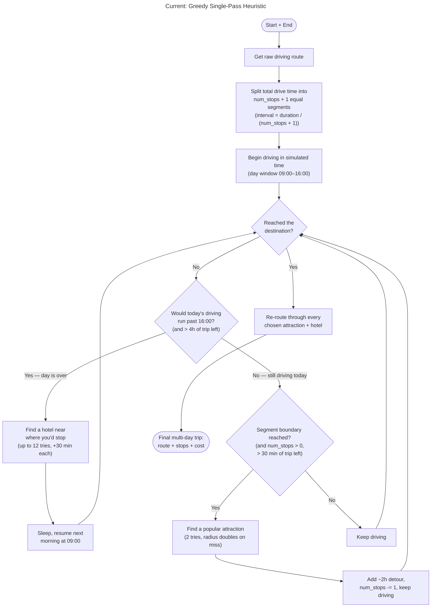
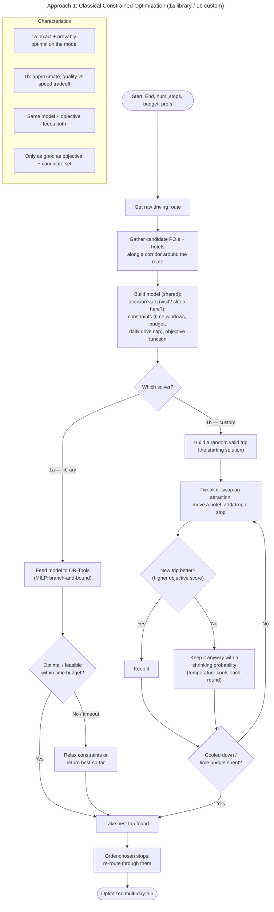
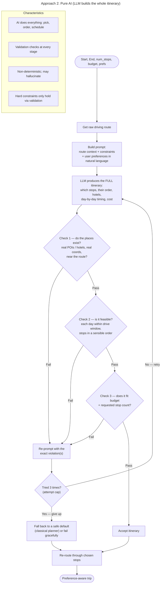
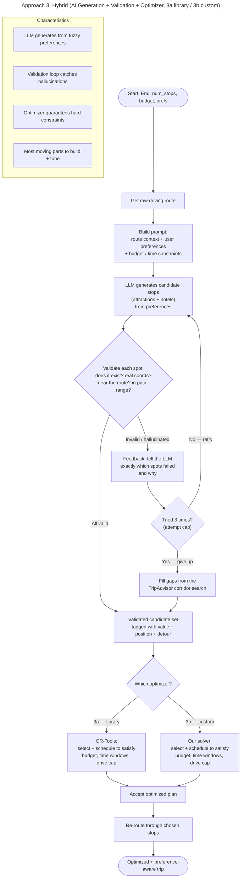

# Route-Finding: Algorithm Analysis

An analytical companion to [route-finding.md](./route-finding.md). Where that
document explains *how the current code works*, this one frames the underlying
problem, defines how we measure a "better" trip, classifies the current
algorithm, and compares three candidate designs for the planned optimization
work: **classical constrained optimization**, **pure AI**, and a **hybrid**.

> Diagram sources and rendered SVGs live in [`diagrams/`](./diagrams).

---

## 1. Problem formalization

Given a fixed origin and destination, a driving route between them, a target
number of attraction stops, a hotel budget, and (optionally) user preferences,
produce a multi-day itinerary that inserts attractions and overnight hotels
along the route.

This is a constrained variant of the **Orienteering Problem** — a "TSP with
profits," where you don't have to visit every node, and each visited node yields
a reward (attraction popularity / preference fit). Layered on top are:

- **Time windows** — a daily driving window (currently 09:00–16:00) and a
  per-attraction time cost (~2h detour).
- **A budget/knapsack constraint** — nightly hotel prices must sum within the
  total budget.
- **A fixed corridor** — stops are chosen near a predetermined start→end driving
  line, so the *ordering* of stops is essentially fixed by geography. The hard
  part is **selection and scheduling** (which attractions, which hotels, when to
  sleep), not **sequencing**.

Naming the distinction matters: classic greedy/DP TSP work is about *ordering
nodes*. Here the order is given; the difficulty is *choosing a subset and timing
it* under multiple constraints.

---

## 2. Objective function (how we score a trip)

"Better" is meaningless without a scoring function. We propose a weighted
objective to **maximize**:

```
score(trip) =  w_v * Σ attraction_value(s)          # total reward collected
             - w_c * total_hotel_cost               # money spent
             - w_d * total_detour_time              # time lost to detours
             - w_p * budget_overrun_penalty         # soft penalty if over budget
```

subject to the hard constraints: each driving day ≤ the daily window, hotels
booked whenever a day ends away from home, and total stops ≈ the requested
`num_stops`.

- `attraction_value(s)` can start as a transform of TripAdvisor rank (e.g.
  `1 / rank`) and later incorporate preference fit.
- The weights `w_v, w_c, w_d, w_p` are tunable and encode what the traveler
  cares about (a "see as much as possible" trip vs. a "cheap and fast" trip).
- This single scalar lets us **compare any two itineraries** — which is the
  backbone of the comparison in §4 and of any future benchmarking.

Evaluation metrics to report per approach: achieved `score`, feasibility rate
(fraction of runs producing a valid trip), wall-clock latency, number of
external API calls, and determinism (same input → same output?).

---

## 3. Current implementation: Greedy Single-Pass Heuristic



**Why it is classified this way:**

- **Greedy** — at each decision point it commits to the locally-best option using
  only local information. `_find_stop` takes the best-ranked attraction near the
  current point without weighing the detour it adds; `_find_hotel` takes the best
  in-budget hotel wherever the day happens to end, with a price band computed only
  from *currently* remaining budget. No choice is scored against downstream
  consequences.
- **Single-pass** — one forward loop (`for _ in range(num_stops + 1)`) walks
  simulated time from departure to arrival, appending each stop as it is found.
  There is no second pass that revisits the assembled itinerary.
- **Heuristic** — the constants (`interval` spacing, the 09:00–16:00 window, the
  ~2h detour, the ±$75 hotel band) are rules of thumb, not values derived from an
  objective. They aim for "good enough," with no optimality guarantee.
- **The tell — no backtracking.** A failed search never rewinds an earlier
  decision; it only widens the attraction radius or advances the hotel search
  time and retries. Once a stop is chosen it is never reconsidered.

**Tradeoff:** cheap, predictable, easy to reason about — at the cost of
suboptimality (a high-rank attraction with a large detour, or an early hotel that
starves the later budget). Closing that gap is the point of the approaches below.

---

## 4. Candidate approaches

### Approach 1 — Classical Constrained Optimization

This approach stops choosing stops one at a time and instead describes the whole
trip as a single optimization problem, then searches the space of complete
itineraries for the best one. We implement it **two ways that share one model**
and differ only in the solver:

- **1a — Library solver (OR-Tools).** An off-the-shelf, exact solver. Our
  reference implementation and correctness oracle.
- **1b — Custom solver (simulated annealing).** A from-scratch metaheuristic we
  design and implement ourselves.

Holding the model fixed and swapping only the solver makes this a controlled
comparison: any difference in trip quality or runtime comes purely from the
search algorithm, not from a different problem definition.



#### The shared model (`build model`)

Both variants begin identically. We fetch the driving route, then gather
candidate attractions and hotels along a corridor around it (the batch
equivalent of today's `_find_stop` / `_find_hotel`, collected up front instead of
on the fly). Then we translate the trip into three things a solver understands:

- **Decision variables** — the knobs the solver may turn. For each candidate
  attraction, a `visit? (0/1)` variable; for each candidate hotel on each night,
  a `sleep-here? (0/1)` variable. A complete trip is one full setting of these.
- **Constraints** — the rules that make a setting legal, the same limits the
  current heuristic enforces by hand but written as equations: total hotel cost
  within budget, each driving day within the 09:00–16:00 window, sleep somewhere
  every night away from home, attractions visited ≈ `num_stops`.
- **Objective** — the single score to maximize (§2): reward high-value
  attractions, penalize cost and detour time. This is what lets the solver rank
  any two legal trips.

This is the hardest part for a person, because every real-world limit has to be
stated explicitly and up front. It is written once and reused by both 1a and 1b.

#### 1a — Library solver (OR-Tools)

We hand the model to [Google OR-Tools](https://developers.google.com/optimization),
a `pip install ortools` package. It uses **branch-and-bound**: it systematically
explores combinations, prunes whole groups of choices it can prove will not beat
the best trip found so far, and narrows in until it returns a solution that is
**provably optimal** (or within a known gap) for the model. It runs against a
time budget; on timeout we relax a constraint or return the best-so-far.

**Role in the project:** this is the *baseline and correctness oracle.* Because
it is provably optimal on the model, it tells us the best achievable score, which
is the ceiling we measure the custom solver against.

#### 1b — Custom solver (simulated annealing)

This is the solver we design and implement from scratch, using only our own
objective and constraints (no solver library). It is a **metaheuristic** —
approximate rather than exact — modeled on annealing in metallurgy:

1. **Start** from a random valid trip.
2. **Tweak** it slightly: swap one attraction for another candidate, move a
   hotel to a different night, or add/drop a stop.
3. **Score** the new trip with the objective function.
4. **Accept** it always if it is better. If it is worse, accept it anyway with a
   probability that depends on how much worse it is and on a "temperature" value.
5. **Cool** the temperature a little each round, so early on the search wanders
   freely (accepting many worse trips to escape local optima) and later it
   settles and only takes improvements.
6. **Stop** when the temperature is low or the time budget is spent, and return
   the best trip seen.

The deliberate willingness to accept a worse trip early is the whole trick: it is
what lets the search climb out of a merely-locally-good itinerary, which the
current greedy heuristic can never do.

**Why it is classified this way:** Approach 1 is *global* rather than greedy —
both variants search whole itineraries and can trade a locally-worse choice for a
globally-better combination. 1a is *exact, deterministic, and explainable*
(branch-and-bound with a written-down objective and constraints). 1b is
*approximate and stochastic* — it does not prove optimality, and different random
seeds can yield different trips, trading that guarantee for simpler
implementation and better scaling on large candidate sets. The shared catch for
both: every constraint must be hand-modeled, and the result is only as good as
the objective function (§2) and the candidate set.

**How we compare 1a vs 1b:** same model, same candidates, same objective. We
report, for each, the achieved objective score (1b as a percentage of 1a's
optimum — the "quality gap"), wall-clock latency, and how each scales as the
number of candidate stops grows. The expected story: 1a is the quality ceiling
but slows sharply as the problem grows; 1b gives up a small, measurable amount of
quality in exchange for staying fast on larger inputs.

### Approach 2 — Pure AI (LLM builds the whole itinerary)

In this approach the AI does the entire job end to end. It does not just suggest
candidate stops for something else to assemble (that is the hybrid). Instead, in
one shot it decides **which stops to visit, what order to visit them in, which
hotels to sleep at, the day-by-day timing, and the cost** — the complete
itinerary. There is no optimizer downstream doing the assembling; the AI *is* the
planner. The entire safety of this approach therefore rests on **validation
checks layered throughout the process**, because nothing in the generation step
itself guarantees the trip is real, drivable, or affordable.



**The validation checks (layered, not a single gate).** Because the AI produces
the whole plan at once, we verify it in stages so a failure is caught at the
earliest, most specific point and the re-prompt can be precise about what to fix:

- **Check 1 — reality.** Do the proposed attractions and hotels actually exist?
  We look each up against a real source (TripAdvisor / a places API), confirm the
  coordinates are real, and confirm they sit near the route corridor. This catches
  the classic hallucination: a plausible-sounding place that is not there.
- **Check 2 — feasibility.** Given real coordinates, is the plan drivable? Each
  day's driving must fit the daily window, and the stop order must make
  geographic sense along the route rather than doubling back.
- **Check 3 — constraints.** Does the total hotel cost fit the budget, and does
  the stop count match roughly what the user asked for?

Any failed check sends the plan back to the model with the **exact violation(s)**
noted ("the second hotel does not exist," "day 2 requires 11 hours of driving,"
"you are $180 over budget"), and the model regenerates. An **attempt cap** (retry
at most ~3 times) keeps this from looping forever. If it still fails after the
cap, we fall back to a safe default — for example, the classical planner from
Approach 1 — or fail gracefully, so the user is never handed a broken trip.

**Why it is classified this way:** it is *generative* — a learned model produces
the entire plan from a natural-language description rather than constructing it
from explicit rules. It is *non-deterministic* (temperature and model state mean
the same input can yield different trips) and *unconstrained by construction* —
nothing in the generation step guarantees the budget, real places, or drivable
days, which is why the **layered validation + re-prompt loop is mandatory, not
optional.** Its strength is handling fuzzy, subjective preferences ("kid-friendly,
scenic, avoid big cities") with no hand-tuned constants and no optimizer to build.
Its risk is that correctness is only ever enforced *after the fact* by the
validators: unlike the hybrid, where an optimizer guarantees feasibility by
construction, here a trip is only as trustworthy as the checks catch.

### Approach 3 — Hybrid (AI Generation + Validation + Optimizer)

This is the strongest design: let AI do the fuzzy, subjective part and let the
optimizer do the hard, rule-bound part. Here the AI does not just re-rank a list
we already gathered — it **generates** candidate stops directly from the user's
preferences in natural language ("scenic, kid-friendly, avoid big cities"). That
flexibility comes with a risk: an AI can hallucinate a place that does not exist
or return coordinates that are wrong. So every generated stop passes through a
**validation feedback loop** before it is allowed near the optimizer. Only a
fully-validated candidate set is handed off, and the optimizer runs as either
**3a** (library / OR-Tools) or **3b** (our custom solver) — the same two solvers
from Approach 1, reused here as the hybrid's optimizer stage.



**How the pieces work.**

- **AI generation (the soft part).** We build a prompt from the route context and
  the user's preferences and ask the LLM to propose stops that fit — attractions
  and candidate overnight spots. This is where the subjective judgment lives:
  matching "quirky roadside stuff, no chain restaurants" is something the model
  does well and the optimizer cannot.
- **Validation feedback loop (the safety net).** Because the model can invent
  places, nothing it produces is trusted on faith. Each generated spot is checked
  against real sources: does it exist (look it up in TripAdvisor / a places API),
  are its coordinates real and actually near the route corridor, and does it fall
  in the plausible price range. Any spot that fails is sent back to the model with
  a specific note about *what* was wrong ("this hotel does not exist," "this is
  120 miles off-route"), and the model tries again. To keep the loop from running
  forever when the model cannot produce valid spots, we use a simple **attempt
  cap**: retry at most a fixed number of times (e.g. 3). If the set is still not
  clean after the cap, we stop asking the model and backfill any remaining gaps
  from the same TripAdvisor corridor search used in Approach 1, so the optimizer
  always receives a complete, real candidate set. The attempt cap and the
  backfill work as a pair — the cap decides *when to stop retrying* and the
  backfill decides *what to do once we stop* — and together they guarantee the
  loop always terminates with a usable candidate set.
- **Optimizer (the hard part, 3a or 3b).** The validated candidates each become a
  decision variable in the shared model, and the optimizer selects and schedules
  them under budget, time windows, and the daily drive cap — exactly as in
  Approach 1. Running it as 3a (OR-Tools) or 3b (our solver) lets us reuse both
  earlier solvers unchanged.

**Why it is classified this way:** it is a *decomposition with a trust boundary*.
The **LLM handles the soft, subjective sub-problem** (generating stops that fit
fuzzy preferences), where there are no crisp rules. The **validator is the trust
boundary** — it converts unreliable AI output into a set of verified, real places
before anything downstream depends on it. The **optimizer handles the hard
sub-problem** (selecting and scheduling under budget and time constraints) and,
because it runs last, the final plan is guaranteed feasible even though an AI
proposed the candidates. The cost is the most engineering of any approach: a
generation stage, a validation loop, and an optimizer, plus the interfaces
between them to build, tune, and evaluate. As with 1a/1b, comparing 3a to 3b is
only meaningful if the validated candidate set is cached and identical for both,
so the solver is the only thing that varies.

---

## 5. Comparison

| Property | Current (greedy) | 1a Classical: library (OR-Tools) | 1b Classical: custom (SA) | Pure AI | 3a Hybrid: library opt. | 3b Hybrid: custom opt. |
|---|---|---|---|---|---|---|
| Optimality on the objective | Local only | Global (provably optimal) | Global (approximate) | Unknown / variable | Global on hard part (exact) | Global on hard part (approx.) |
| Backtracking / lookahead | None | Yes (branch-and-bound) | Yes (accepts worse moves) | Implicit, unreliable | Yes (optimizer) | Yes (optimizer) |
| Determinism | Deterministic | Deterministic | Non-deterministic (seed) | Non-deterministic | Non-det. gen., det. opt. | Non-deterministic |
| Hard-constraint guarantee | Best-effort | Yes | Yes | Only via validator | Yes (optimizer) | Yes (optimizer) |
| Handles fuzzy preferences | No | Poorly (must encode) | Poorly (must encode) | Yes | Yes (LLM stage) | Yes (LLM stage) |
| Explainability | High | High | Medium | Low | Medium–high | Medium |
| Hand-tuned constants | Many | Few (in objective) | Some (cooling schedule) | None | Some | Some (+ cooling schedule) |
| External API / compute cost | Moderate | Higher (solver) | Moderate | Higher (LLM calls) | Highest (LLM + solver) | High (LLM + custom) |
| Implementation effort | Low (built) | Low (library call) | Medium (write it yourself) | Medium | High | Highest (custom + AI loop) |
| Scaling on large candidate sets | Good | Degrades (exact search) | Good | n/a | Degrades (exact search) | Good |

**Reading of the table.** The current greedy heuristic is the cheapest to run
and reason about but leaves value on the table. Classical optimization directly
attacks that gap with global search: **1a** (OR-Tools) is provably optimal on the
model and acts as the correctness ceiling, but its exact search slows as the
candidate set grows; **1b** (our simulated-annealing solver) gives up a small,
measurable amount of quality but stays fast on larger inputs and is the piece we
actually design and implement. Both pay the same price of modeling every
constraint explicitly, which is hard for subjective tastes. Pure AI is the
opposite: effortless with fuzzy preferences, but with no built-in guarantee that
the trip is affordable or drivable. The hybrid keeps the AI's flexibility on the
subjective sub-problem and the optimizer's guarantees on the strict one, which is
why it is the strongest thesis position — at the cost of being the most to build.
Its two variants mirror the classical split: **3a** pairs the AI generation +
validation loop with the OR-Tools optimizer, and **3b** pairs it with our custom
solver, so 3a-vs-3b measures the same solver tradeoff as 1a-vs-1b but on an
AI-generated (then validated) candidate set.

---

## 6. Suggested next steps

1. Fix the objective weights (§2) to a concrete traveler profile so results are
   comparable.
2. Build an offline benchmark: a handful of fixed origin/destination/budget cases
   with cached candidate POIs and hotels, so approaches can be scored on the same
   inputs without live API variance.
3. Implement the shared model first (variables, constraints, objective), then
   **1a** on top of it with OR-Tools to establish the provably-optimal baseline.
   Then implement **1b**, the custom simulated-annealing solver, against the same
   model, and benchmark it on the fixed cases to measure its quality gap and
   runtime versus 1a. Approach 3 can later reuse this optimizer as its second
   stage, and Approach 2 stays the flexibility/quality ceiling for preference
   handling and a useful comparison point.
