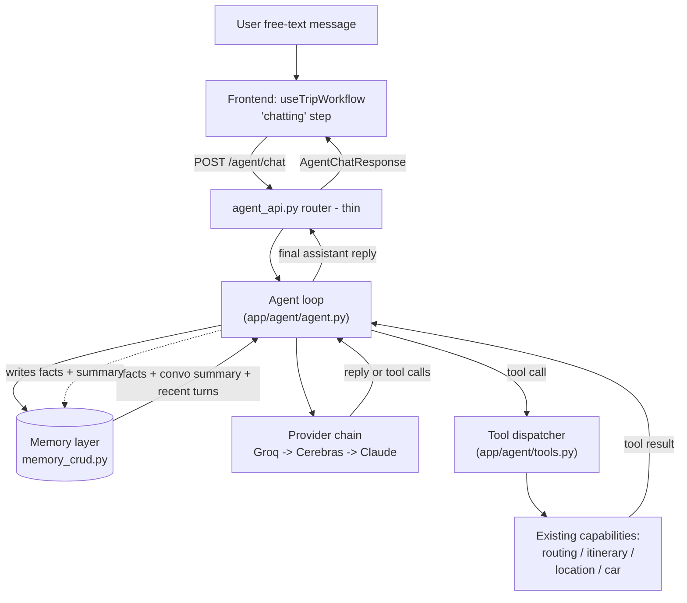

# Chat Agent: Design & Contracts

The design spec for the conversational chat agent — a tool-using LLM assistant
layered on top of the existing trip-planning workflow. Where
[algorithm-analysis.md](./algorithm-analysis.md) frames the routing research,
this document frames the **agent**: how a free-text user message becomes an
assistant reply, how the agent remembers the user, and how it calls the app's
existing capabilities as tools.

It exists to **freeze three contracts** so the backend endpoint, the memory
layer, and the frontend can be built in parallel:

1. **Agent request/response** (backend ↔ frontend)
2. **Memory model** (agent loop ↔ persistence)
3. **Tool interface** (agent loop ↔ existing app capabilities)

> Status: implemented and verified live. The LLM provider is the self-hosted
> **Mentro gateway** (SSE, Supabase service-account auth) — see §6. Because that
> gateway has **no native function-calling**, tool-calling uses a **text
> protocol** (§5b) rather than structured `tool_calls`. The frontend is now
> **fully agent-driven** — the scripted step machine and its input widgets were
> removed in favor of a single chat bar (§8). The end-to-end loop (text-protocol
> tool call → dispatch → reply) is confirmed against the live gateway.

---

## 1. Where this sits today

The current chat is **not** conversational — it is a deterministic
trip-planning **state machine**:

- **Frontend** `frontend/src/pages/ChatPage/useTripWorkflow.js` walks a fixed
  step enum (`start_input → end_input → stops_input → budget_input → car_input →
  generating_route → done`). Each step does one unit of async work; there is no
  free-text understanding.
- **Backend** `app/routers/chat_api.py` + `app/crud/chat_crud.py` is pure CRUD:
  it persists a chat's `ChatData` (trip snapshot) and `ChatLog` (message list) to
  Neon Postgres. No LLM is involved anywhere.

The agent is **additive**. It does not replace the scripted machine; it runs
alongside it as a new capability the user can talk to. The scripted flow remains
the fast path for structured trip building; the agent handles everything the
script can't (questions, preferences, "actually make it cheaper", "add a stop in
Denver").

---

## 2. Architecture at a glance



Module layout (new code):

```
backend/app/
├── agent/
│   ├── __init__.py
│   ├── schemas.py        # AgentChatRequest / AgentChatResponse (contract 1)
│   ├── providers.py      # LLMProvider interface + Groq/Cerebras/Claude + FallbackChain
│   ├── tools.py          # tool schemas + ToolDispatcher (contract 3)
│   ├── memory.py         # MemoryStore interface (contract 2) — impl in crud/memory_crud.py
│   ├── prompt.py         # system-prompt + context assembly
│   └── agent.py          # the loop: assemble → call provider → run tools → persist
├── crud/
│   └── memory_crud.py    # Postgres-backed MemoryStore implementation
└── routers/
    └── agent_api.py      # thin router: POST /agent/chat
```

Design principle carried over from the routing layer: **the agent loop reaches
providers, memory, and tools only through injected interfaces**, so the whole
loop is testable with fakes (no network, no DB). This mirrors `RoutingServices`.

---

## 3. Contract 1 — Agent request/response (backend ↔ frontend)

Pydantic v2 models in `app/agent/schemas.py`. The frontend posts the user's
message plus enough context to identify the chat; the backend owns memory
retrieval, so the frontend does **not** send history — it sends the new message
and the chat id, and the server rehydrates context from persistence.

### Request — `POST /agent/chat`

```jsonc
{
  "partitionKey": "<Cognito access token>",   // decoded server-side to user_id (sub)
  "chatId": "42",                              // string; scopes conversation memory
  "message": "make the trip cheaper and add something fun near Denver",
  "clientContext": {                            // optional, best-effort UI state
    "hasRoute": true,
    "stops": 3,
    "hotelBudget": 450
  }
}
```

```python
class AgentClientContext(BaseModel):
    hasRoute: bool = False
    stops: Optional[int] = None
    hotelBudget: Optional[int] = None
    # extend as needed; purely a hint to the agent, never trusted for state

class AgentChatRequest(BaseModel):
    partitionKey: str
    chatId: str
    message: str
    clientContext: Optional[AgentClientContext] = None
```

`partitionKey` is decoded with the existing
`app/utils/auth.py::get_user_id_from_token` → `user_id`. Memory is keyed by
`(user_id, chat_id)` for conversation and by `user_id` for cross-chat facts.

### Response

```jsonc
{
  "reply": "Dropped your hotel budget to $320 and added Red Rocks near Denver...",
  "toolsUsed": ["generate_final_route", "find_attraction"],
  "actions": [                                  // structured side effects the UI may apply
    { "type": "route_updated", "chatId": "42" }
  ],
  "provider": "groq",                           // which provider actually served it
  "usage": { "promptTokens": 1840, "completionTokens": 210 }  // best-effort, may be null
}
```

```python
class AgentAction(BaseModel):
    type: str                    # e.g. "route_updated", "itinerary_updated", "none"
    chatId: Optional[str] = None
    payload: Optional[dict] = None

class AgentUsage(BaseModel):
    promptTokens: Optional[int] = None
    completionTokens: Optional[int] = None

class AgentChatResponse(BaseModel):
    reply: str
    toolsUsed: List[str] = []
    actions: List[AgentAction] = []
    provider: Optional[str] = None
    usage: Optional[AgentUsage] = None
```

**Why `actions`:** when the agent calls a tool that mutates trip state (e.g.
regenerates the route), the frontend needs to know to refetch/re-render. `actions`
is the typed signal for that — the UI reads the DB (source of truth) and applies
it, consistent with the "read state live from context / DB" rule.

**Error mapping (router):** upstream provider failure after all fallbacks →
`503`; bad request/validation → `422`/`400`; tool execution failure is caught
inside the loop and surfaced to the model (not a hard HTTP error) so it can
recover or explain. The router stays thin.

---

## 4. Contract 2 — Memory model (agent loop ↔ persistence)

Memory holds **both** facts and conversation, per the product goal. Two tiers:

| Tier | Scope | What | Lifetime |
|---|---|---|---|
| **Conversation** | per `(user_id, chat_id)` | recent turns (verbatim) + a rolling summary of older turns | lives with the chat |
| **Facts** | per `user_id` (cross-chat) | durable structured facts about the traveler | persists across all chats |

### Facts — structured, cross-chat

Facts are the interesting research link: they can later feed the routing
**objective function** (e.g. preference weights) and personalize planning.

```python
class MemoryFact(BaseModel):
    key: str          # namespaced, e.g. "home_city", "pref.avoid", "budget.style"
    value: str        # free-text or scalar-as-string
    confidence: float = 1.0
    source_chat_id: Optional[str] = None
    updated_at: datetime
```

Example facts: `home_city="Boston, MA"`, `pref.likes="national parks, diners"`,
`pref.avoid="big cities"`, `budget.style="frugal"`, `car="2020 Mazda CX-3"`.

Writes are **upsert by (user_id, key)** — newer/higher-confidence facts replace
older ones. Fact extraction runs after each turn (see §7).

### Conversation — per chat

The verbatim recent window comes from the existing `ChatLog.messages` already
persisted by `chat_crud.py` — we do **not** duplicate it. The agent adds a
**rolling summary** so long chats don't blow the context window:

```python
class ConversationMemory(BaseModel):
    chat_id: str
    summary: str = ""            # rolling summary of turns older than the recent window
    summary_turn_count: int = 0  # how many turns are folded into `summary`
    updated_at: datetime
```

### Storage — `chat_memory` table (Neon Postgres)

Follows `chat_crud.py` conventions (connection pool, `user_id` first arg). One
table with a small type discriminator keeps the migration trivial:

```sql
CREATE TABLE IF NOT EXISTS chat_memory (
    user_id     TEXT        NOT NULL,
    chat_id     TEXT,                    -- NULL for cross-chat facts
    mem_type    TEXT        NOT NULL,    -- 'fact' | 'summary'
    mem_key     TEXT        NOT NULL,    -- fact key, or 'summary' for the summary row
    mem_value   JSONB       NOT NULL,    -- MemoryFact / ConversationMemory payload
    confidence  REAL        DEFAULT 1.0,
    updated_at  TIMESTAMPTZ DEFAULT now(),
    PRIMARY KEY (user_id, chat_id, mem_type, mem_key)
);
```

### `MemoryStore` interface (what the agent loop depends on)

```python
class MemoryStore(Protocol):
    def load_facts(self, user_id: str) -> list[MemoryFact]: ...
    def upsert_facts(self, user_id: str, facts: list[MemoryFact]) -> None: ...
    def load_conversation(self, user_id: str, chat_id: str) -> ConversationMemory: ...
    def save_conversation(self, user_id: str, chat_id: str, mem: ConversationMemory) -> None: ...
```

The real implementation is `crud/memory_crud.py`; tests inject an in-memory fake.

### The structured `UserProfile` (the typed "all user data" model)

Above the loose facts sits a single **validated** profile — the JSON model the
app holds per user and feeds into the routing/car APIs. It lives in
`app/agent/profile.py`:

```python
class UserProfile(BaseModel):
    home_city: str | None
    home_coords: list[float] | None        # validated [lat, lon]
    default_stops: int | None              # validated 1..10
    hotel_budget_style: BudgetStyle | None # frugal | moderate | luxury
    car: Car | None                        # {year (>=1984), make, model}
    likes: list[str]                       # deduped, trimmed
    avoids: list[str]
    preferred_algorithm: str | None        # must be a registered planner
```

- **Persistence stays fact-based**: the whole profile round-trips through ONE
  `MemoryFact` (`key="profile"`, `value=<json>`) via `to_fact` / `from_facts`, so
  `memory_crud` and the `chat_memory` table are untouched.
- **Capture is tool-driven** (no second LLM call): the agent calls
  **`update_profile`** with the field(s) it learned — validated as a partial
  `ProfileUpdate`, merged (`merged_with`: scalars overwrite, `likes`/`avoids`
  union), and persisted. **`get_profile`** returns the current profile. There is
  **no** separate `extract_facts_from_turn` pass anymore (it's a documented
  no-op).
- **Fed into the APIs as defaults**: `generate_final_route` defaults
  `num_stops`/`budget`/`algorithm` from the profile (`default_stops`,
  a band from `hotel_budget_style`, `preferred_algorithm`) when the model omits
  them — explicit args always win — and `get_car_budget` falls back to the stored
  `car`. Everything is re-validated by `Route_Payload`, so profile-sourced values
  are safe.

### Heavy objects, handles, and remote routing (avoiding the 413)

The routing tools produce large objects (a full Mapbox route, a planned
`Route`) that must **not** ride in the LLM's message history — doing so blew the
gateway's request-size limit (a 413). Two mechanisms keep the context small and
the trip complete:

- **Artifact store (per-turn handles).** `get_initial_route` /
  `generate_final_route` stash the heavy object in a per-turn `ArtifactStore`
  (on `ToolContext`) and return only a short `route_handle` + a human summary.
  The next tool takes the handle back and resolves it. `run_turn`'s
  `_tool_result_content` also strips bulky keys (`route`/`geometry`/`stops`/…)
  from the message the model sees. The **full** payload still reaches the
  frontend via `action.payload`. `get_initial_route` accepts flat *or* nested
  start/end coords.

- **Remote routing proxy (B1).** TripAdvisor / hotel / Mapbox calls only work
  from the deployed backend's whitelisted IP. When `ROUTING_REMOTE_URL` is set
  (local dev), the three routing tools proxy through that deployed backend's
  existing `/get-initial-route`, `/generate-final-route`, `/generate-itinerary`
  endpoints (`app/agent/routing_remote.py`) and re-validate the JSON into the
  same Pydantic models the local path returns — so the tool handlers and artifact
  store are unchanged. When unset (running *on* the deployed backend), the tools
  run routing locally. Same code, both places.
- **Prompt**: the agent consults the profile before re-asking known info, and is
  instructed to *actually emit* the `update_profile` tool block for durable prefs
  (not just claim it remembered in prose). The profile is rendered as a readable
  block in the system context — raw profile JSON is never dumped into the prompt.

---

## 5. Contract 3 — Tool interface (agent loop ↔ existing capabilities)

The agent may call any tool it needs. Tools are **thin adapters** over existing
capabilities — they do not reimplement logic, they call the same functions the
routers use. This preserves the fixed routing/stop-dict contract.

### Tool registry (v1)

| Tool name | Wraps | Purpose |
|---|---|---|
| `validate_location` | `location_api` / geolocation helpers | resolve an address or coords |
| `get_initial_route` | routing `sources/mapbox` | raw driving route between two points |
| `generate_final_route` | `routing` planners (via `get_planner`) | full multi-day trip; honors `algorithm` |
| `generate_itinerary` | `itinerary_api` logic | day-by-day itinerary from a route |
| `find_attraction` | routing `sources/attractions` | attractions near a point (TripAdvisor) |
| `get_car_budget` | `car_api` | MPG + gas cost estimate |
| `recall_facts` | memory layer | read what we know about the traveler |
| `remember_fact` | memory layer | explicitly store a fact the user stated |

### Tool schema + dispatcher

Each tool declares a name, description, and JSON-schema parameters (the shape
LLM function-calling APIs expect). A `ToolDispatcher` maps a tool name +
arguments to a Python callable and returns a JSON-serializable result.

```python
class ToolSpec(BaseModel):
    name: str
    description: str
    parameters: dict          # JSON Schema for the arguments

class ToolCall(BaseModel):
    name: str
    arguments: dict

class ToolResult(BaseModel):
    name: str
    ok: bool
    result: Optional[dict] = None
    error: Optional[str] = None

class ToolDispatcher(Protocol):
    def specs(self) -> list[ToolSpec]: ...              # advertised to the model
    def dispatch(self, call: ToolCall, ctx: "ToolContext") -> ToolResult: ...
```

`ToolContext` carries `user_id`, `chat_id`, and the injected services/memory so
tools can read/write the right scope. **Tool failures are captured as
`ToolResult(ok=False, error=...)`** and fed back to the model rather than raising
— the agent can then retry, pick another tool, or explain. Tests inject a fake
dispatcher.

**State-mutating tools carry their payload back to the client.** There is no
GET-by-chat endpoint to re-read a freshly planned trip, so `generate_final_route`
and `generate_itinerary` return their result data (`route` / `stops` / `cost` /
`itinerary`) in the `ToolResult`, and the agent loop forwards it on the
`AgentAction.payload` (§3). The frontend writes that payload straight into
`ChatData` so the Map/Itinerary pages render — see §8.

---

## 5b. The text-based tool-call protocol (how tools actually fire)

The Mentro gateway (§6) is a plain chat-completion passthrough: it streams text
and never returns structured `tool_calls`. So the model requests tools **in its
reply text** using a fenced block, and `app/agent/toolcall_parser.py` extracts
them:

    ```tool
    {"tool": "validate_location", "arguments": {"address": "Denver, CO"}}
    ```

- Zero or more blocks per reply; independent calls may be batched.
- `parse_tool_calls(text)` → `list[ToolCall]`; malformed JSON or a block missing
  a string `tool` name is skipped (never raised).
- `strip_tool_blocks(text)` yields the user-facing prose (raw tool JSON is never
  shown to the traveler).
- The agent loop (§7) is driven by *parsed* calls, not `response.tool_calls`:
  parse → dispatch each → feed `ToolResult`s back as follow-up messages → re-ask,
  capped at `MAX_TOOL_ITERATIONS`. When a reply has no tool block, it's final.

This keeps the wire format in one module, so the protocol can evolve without
touching the loop. It also means the served model **must follow instructions and
emit final-channel content** — a reasoning-only model that never emits a final
answer (observed with `gpt-oss-20b`) does not work; an instruct model is
required.

---

## 6. Contract 1b — Provider fallback chain (internal)

Free REST models first, Claude as the paid safety net.

```
Groq  ──(error/timeout/rate-limit)──▶  Cerebras  ──(error/…)──▶  Claude  ──▶ 503
```

```python
class LLMMessage(BaseModel):
    role: str          # "system" | "user" | "assistant" | "tool"
    content: str
    tool_calls: Optional[list[ToolCall]] = None
    tool_call_id: Optional[str] = None

class LLMResponse(BaseModel):
    content: str = ""
    tool_calls: list[ToolCall] = []
    provider: str = ""
    usage: Optional[AgentUsage] = None

class LLMProvider(Protocol):
    name: str
    def complete(self, messages: list[LLMMessage], tools: list[ToolSpec]) -> LLMResponse: ...
```

**As implemented, the single provider is the self-hosted Mentro gateway**, not a
Groq/Cerebras/Claude chain. `MentroGatewayProvider` POSTs the assembled messages
to `{MENTRO_GATEWAY_URL}/api/chat/stream-full`, consumes the SSE stream
server-side, and returns the aggregated `end` payload as an `LLMResponse`
(non-streaming from the loop's view). The gateway fronts its own upstream tiers
(Cerebras → Groq → Together), so `LLMResponse.provider` is recorded as
`mentro:<tier>`.

- **Auth** is a Supabase JWT minted from a dedicated service account, isolated in
  the `SupabaseServiceAuth` seam (password grant + refresh). Env:
  `MENTRO_GATEWAY_URL`, `SUPABASE_URL`, `SUPABASE_ANON_KEY`,
  `MENTRO_SERVICE_EMAIL`, `MENTRO_SERVICE_PASSWORD`. Missing creds →
  `ProviderNotConfigured` → the router 503s cleanly.
- **Empty-completion retry**: reasoning-capable models occasionally return blank
  `content`; the provider retries a bounded number of times, and prefers
  `content` but falls back to the gateway's `reasoning` field.
- `FallbackChain` still wraps the provider list (skips unconfigured, advances
  past `ProviderError`, raises `ProvidersExhausted`) so a second provider can be
  added later without touching the loop. It currently holds just the gateway.

---

## 7. The agent loop

`app/agent/agent.py::run_turn(request, providers, memory, tools) -> AgentChatResponse`:

1. **Resolve identity** — `user_id = get_user_id_from_token(partitionKey)`.
2. **Load memory** — facts (`user_id`) + conversation summary + recent verbatim
   turns (from existing `ChatLog`).
3. **Assemble messages** — system prompt (`prompt.py`) + facts + summary +
   recent turns + the new user message. Advertise `tools.specs()`.
4. **Call provider chain** — `providers.complete(messages, tools)`.
5. **Tool loop (text-protocol, §5b)** — `parse_tool_calls(response.content)`;
   while there are parsed calls: `tools.dispatch(...)` each, append `ToolResult`s
   as `tool` messages, re-ask the provider, re-parse. Cap iterations (5) to
   guarantee termination. The user-facing `reply` is `strip_tool_blocks(content)`.
6. **Persist** — memory write-back through the injected `MemoryStore`: extract
   facts (`extract_facts_from_turn` — a no-op stub today, wired for later) and
   `upsert_facts`, and roll the conversation summary once the verbatim window
   passes `SUMMARY_WINDOW`. Best-effort: a persistence failure never breaks the
   reply. The verbatim `ChatLog` is **not** written here — the frontend owns that.
7. **Return** `AgentChatResponse` with `reply`, `toolsUsed`, `actions`,
   `provider`, `usage`.

The loop is deterministic in structure; only the provider calls are
non-deterministic. Every dependency (providers, memory, tools) is injected, so
`run_turn` is unit-testable end-to-end with fakes.

---

## 8. Contract 4 — Frontend integration (backend ↔ UI)

**The scripted step machine is gone.** `useTripWorkflow.js` is now a thin
agent-chat hook, and the per-step input widgets (`LocationInput`, `InputStops`,
`InputBudget`, `InputCar`) were deleted. A single persistent `ChatInput` bar
drives the whole flow — the agent conversationally gathers start / destination /
stops / budget and calls the tools itself.

- `submit('chat_message', text)` appends the user text, shows the loader, calls
  `agentChat.js::sendAgentMessage` (POST `agent/chat`), and renders the reply via
  `addMessage(...)`. **No polling; messages read live from the `chats` context.**
- `applyAgentActions(actions)` consumes the typed `actions`:
  - `route_updated` → writes `payload.route` into `ChatData.route`, and **derives
    `startConfirmed`/`endConfirmed` from `route.coordinates[0]` / `[-1]`** (as
    `{latitude, longitude, address:''}`) so `Map.jsx` — which reads those — never
    crashes. Also sets `budget`/`stops`/`cost` from the payload.
  - `itinerary_updated` → writes `payload.itinerary` into `ChatData.itinerary`.
  - The resulting `ChatData` snapshot is written into `ChatLogsData.chatdata` and
    persisted via `updateUserData`, so the Map/Itinerary pages (which read
    `ChatLogsData.getChatDataById(currentId)`) render without any GET-by-chat
    endpoint.
- Header/TripSearch progress derives from `ChatData` via `deriveProgress`
  (route present → done) instead of a step enum.
- Loading uses the existing loader bubble; the friendly-fallback message shows if
  the agent returns null.

---

## 9. Parallelization plan

Once §3–§6 contracts are frozen (they are), the streams are independent:

- **Stream A** — `agent/schemas.py`, `providers.py`, `prompt.py`, `agent.py`,
  `routers/agent_api.py`, registered in `main.py`. Built against a **fake
  provider** and fake memory/tools. Unblocked now.
- **Stream B** — `crud/memory_crud.py` + `chat_memory` migration, implementing
  `MemoryStore`. Tested against a fake DB / real Neon.
- **Stream C** — `useTripWorkflow.js` `chatting` step + `agentChat.js` + tests.
  Depends only on §3 (request/response).
- **Stream A-tools** — `agent/tools.py` dispatcher wrapping existing
  capabilities, tested with fakes.
- **Integration** — swap fakes for real providers (keys), wire `memory_crud`
  into the loop, point the frontend at the live endpoint, run `pytest` + `ruff`
  (backend) and `vitest` + `lint` (frontend).

## 10. Open questions / v2

- **Fact extraction quality** — v1 can use a cheap LLM pass or simple heuristics;
  measuring extraction precision/recall is a natural research sub-track.
- **Feeding facts into routing** — wiring `pref.*` facts into the objective
  function weights (§2 of algorithm-analysis) connects the chatbot to the routing
  research. Deferred to after v1 round-trip works.
- **Streaming** — v1 returns a single reply; token streaming (SSE) is a later UX
  improvement.
- **Cost/latency metrics** — logging `provider` + `usage` per turn gives the same
  kind of comparative data the routing benchmark produces.
