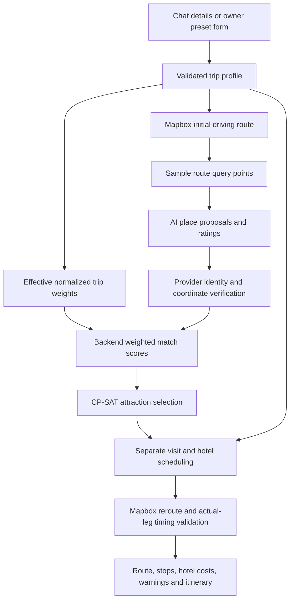

# Explain RoadtripsAreFun's CP-SAT pipeline

Source baseline: feature `53fd0bf` plus the senior-demo implementation, October 4,
2026. The refactor preserves selection mathematics. The owner `/algorithm` screen
exposes the actual computation. See the [implementation contract](senior-demo-plan.md)
and [public release/MacBook runbook](senior-demo-runbook.md).

## The sentence to remember

“We collect a trip profile, describe verified candidate places with a shared set
of interests, calculate how well each place matches the trip, use CP-SAT to select
attractions under count and geographic-slot constraints, then schedule and verify
the actual route.”

The language model proposes/rates places and extracts conversation details.
The backend validates inputs and calculates scores. CP-SAT selects a subset.
Mapbox supplies road geometry and drive durations. The scheduler inserts hotels
and visits. These are separate responsibilities.



## 1. Where the inputs come from

| Input | Origin and transformation | Used by |
| --- | --- | --- |
| Start/end | Chat extraction proposes addresses; provider resolution and explicit user confirmation establish coordinates | Initial Mapbox route and query points |
| Departure | User's local date/time plus origin IANA timezone, normalized to an offset-aware datetime | Hotel dates and scheduling, not the subset objective |
| Stops `n` | Validated requested attraction count; chat allows 1–10 | Query count and CP-SAT cardinality cap |
| Travelers and rooms | Explicit total plus adults/child ages in each room | Validated dated hotel quotes; never inferred group personality |
| Budget | User's USD nightly target per room | Hotel preference/warnings, not a CP-SAT budget constraint |
| Account persona | Saved account weights; equal defaults if absent | Baseline preference vector |
| Trip override | Interests explicitly supplied for this trip | Override supplied baseline keys, then normalize |
| Location attributes | LLM produces 14 ratings in `[0,1]` for each proposed name | Backend preference match; ratings are estimates |
| Place identity/coordinates | Terra records, normalized name match, radius check and deduplication | Accept/reject candidate and assign nearest route slot |
| Hotel price | Dated Google Hotels offer for each requested room | Actual room quote totals, warnings and hotel choice |
| Car | User-supplied validated vehicle or explicit skip | Fuel estimate elsewhere; not CP-SAT attraction selection |

The same 14 interests are `scenery`, `nature`, `hiking_outdoors`, `food`,
`history`, `culture_arts`, `nightlife`, `shopping`, `beaches_water`, `adventure`,
`relaxation`, `unique_local_experiences`, `family_friendliness`, `crowd_avoidance`.
`backend/app/agent/persona.py` is their authoritative key list. The current
`routing/profiles.py` generates `AttributeRatings` from that key list. The frontend
consumes the backend catalog rather than maintaining another interest vocabulary.

An account persona is long-lived; a trip profile describes this journey. A
location profile describes a place. Its match score belongs to a particular
trip-location comparison, not to the place universally. `LocationProfile` now
models provider fields, typed ratings and provenance before candidate serialization.
There is no persistent, evidence-calibrated location-profile database.

## 2. Turn profiles into a score

Let `w[k]` be the trip's importance for interest `k`, and `a[i,k]` be place `i`'s
rating for that interest. Weights are nonnegative and sum to one. Ratings are
between zero and one. The backend calculates:

```text
utility[i] = sum(w[k] * a[i,k] for k in the 14 interests)
```

This weighted sum lies in `[0,1]`; the implementation also clamps numerical
roundoff. It is a modeled match, not a probability of enjoyment or a calibrated
percentage. Each product is an explainable contribution.

Teaching example: all other interest weights are zero.

| Place | Nature rating | History rating | Food rating | Nature-trip utility | Culture-trip utility |
| --- | --- | --- | --- | --- | --- |
| A: forest walk | .9 | .2 | .3 | .6×.9 + .3×.2 + .1×.3 = **.63** | .1×.9 + .7×.2 + .2×.3 = **.29** |
| B: historic market | .2 | .9 | .8 | .6×.2 + .3×.9 + .1×.8 = **.47** | .1×.2 + .7×.9 + .2×.8 = **.81** |
| C: scenic museum | .8 | .8 | .4 | **.76** | **.72** |

The actual Lab fixture also includes Local gardens (.70 under both profiles)
and a low-match candidate. With two stops it selects C + Local gardens for nature
and B + C for culture. The smaller table isolates the matching arithmetic.

The nature vector is `(.6,.3,.1)` and the culture vector is `(.1,.7,.2)`.
If A/B share slot 0, C is in slot 1, and two stops are requested, the nature trip
selects A+C, while the culture trip selects B+C. The place descriptions stay
fixed; only trip preferences change. All ratings here are synthetic teaching
values, not verified claims about named attractions.

`effective_weights()` first normalizes the account vector, replaces only keys
provided by a trip override, then normalizes again. Omitted keys keep baseline
values. A preset that intends exactly the example above must supply all 14 keys,
with zeros for the other 11. The all-zero vector is invalid.

`persona_candidates._candidate()` calls shared `profiles.crossmatch()` in Python. AI-supplied
final utility, coordinates and prices are not used. Provider verification does
not verify subjective ratings. That distinction is essential when explaining
the quality and limitations of the inputs.

## 3. Build a bounded candidate problem

For positive `n`, `CPSatPlanner.plan()` chooses:

```text
K = min(30, max(6, 3*n))
query time[j] = initial_route.duration * j / (K+1), j = 1..K
```

The injected `find_position` maps those driving-time positions to route
coordinates. For `n=2`, there are six sample points. They provide geographic
coverage; they do not guarantee optimal places or uniform geographic distance.

At each point the LLM proposes at most five names and ratings. Terra supplies
place records. Matching requires normalized names, valid provider identity and
coordinates, a five-mile radius, and unique provider IDs. Collection stops at
30 accepted attractions. Earlier samples can fill the cap before later ones.
The live attraction proposal prompt currently uses the location, not the trip
weights; the personalization happens in backend scoring after collection.

`cp_sat_selection._prepare()` filters malformed/duplicate candidates and utilities below **0.60**.
Every remaining candidate is assigned to its nearest query point by geodesic
distance. Candidates sort by `(query_index, provider_id)` before modeling.
Two candidates assigned to the same point compete for one slot. This is not a
measured road-distance separation constraint, and a looping route can challenge
the assumption that nearest-slot order equals real route progress.

## 4. What CP-SAT actually optimizes

CP means constraint programming; SAT refers to Boolean satisfiability. You
declare decision variables, hard rules, and an objective, then ask OR-Tools to
find a valid assignment with a high objective. It is not a language model.

For every eligible attraction `i`, create a Boolean decision variable:

```text
x[i] = 1 if selected, otherwise 0
sum(x[i]) <= requested stops
for every slot s: sum(x[i] for i in slot s) <= 1
```

These are the current model's two constraint families. Utility threshold and
provider verification are preprocessing filters, not additional solver variables.
There are no hotel, travel-time, total-budget or opening-hour decision variables
in this solve. `num_stops` is a maximum, not a promise of exactly that many stops.

The exact objective includes integer scaling and a stable preference for earlier
sorted candidates. Let `m` be eligible candidate count and use zero-based `i`:

```text
q[i] = round((utility[i] - 0.60) * 1_000_000)
B = m * (m + 1)
c[i] = q[i] * (B + 1) + m - i
maximize sum(c[i] * x[i])
```

CP-SAT uses integer arithmetic for the model. Scaling turns match surplus into
integer units. The large multiplier makes any one-unit improvement in total
rounded surplus dominate all possible tie terms. `m-i` is a small secondary
preference; different subsets can still have equal sums of tie terms. Stable
ordering, a single worker and seed zero support repeatability for a fixed
problem, not a universal guarantee across live inputs or solver versions.

The implementation maximizes **rounded surplus above .60**, not the historical
value-minus-cost-minus-detour metric. At fixed selected count this ranks total
utility the same, apart from rounding. All eligible coefficients are positive,
so a proved optimal result fills as many distinct eligible slots as the cap
allows, including a candidate exactly at .60. A merely feasible timed result
does not provide that optimality guarantee.

The five-second, one-worker solve returns a status. **OPTIMAL** proves the best
modeled objective for this candidate set. **FEASIBLE** finds a valid selection
without proving it best. Other statuses are rejected by current code. The
current error mapping groups non-infeasible failures as timeout; an explanation
refactor should preserve the actual status rather than invent a success. When
there are no eligible candidates, `_select()` returns before calling the solver.
With only these upper-bound constraints, choosing nothing is always feasible.

These concepts and status meanings follow the official
[OR-Tools CP-SAT documentation](https://developers.google.com/optimization/cp/cp_solver).
The application's coefficients, limits and behavior above come from its own
source, not a generic OR-Tools tutorial.

## 5. What happens after selection

The solver decodes selected candidates in slot order. The separate scheduler
uses initial-route time estimates, adds two-hour attraction visits, and inserts
overnights. Default preferred hotel arrival is 18:00, hotel cutoff 20:00,
morning restart 09:00; default destination cutoff is 21:00. Optional policy
changes and arrival-local timezones/DST affect those limits.

Hotel discovery tries bounded nearby overnight positions, at most six per
attempt sequence. It selects among usable hotels at the first successful
position by: all room prices within target first, higher hotel utility, lower
total quote, shorter geographic distance, then provider ID. It is a local
heuristic, not a CP-SAT hotel optimization. Each requested room has a separate
dated quote; summed quotes do not guarantee simultaneous availability.

Mapbox then reroutes through the selected attractions and hotels. The backend
checks actual leg counts/durations, resolves local timezones and applies shared
timing rules. A detour may invalidate a selection that looked schedulable from
the original route. That fails the plan; it does not automatically trigger a
joint reoptimization of attractions and hotels.

The Route response includes coordinates, geometry, road distance, driving
duration, ordered stops with leg durations/timing, total hotel quote cost,
occupancy, departure, policy and warnings. Driving duration is not total vacation
elapsed time; hotel cost is not the whole-trip budget. Itinerary generation is
a separate step and can fail after route success. Existing completion code
retains a partial route and permits a retry.

Current ordinary output does not expose all rejected candidates, attribute
contributions or CP-SAT status/bound. The Lab adds these directly from the computation, including actual solve
status, objective, best bound and solve time. `base.score_trip()` is an older benchmark metric and must not be
presented as the solver objective.

## 6. Read the code in this order

Paths below are relative to the repository root. Search the named symbols so
the walkthrough remains usable after line numbers change.

| File / symbol | What to explain |
| --- | --- |
| `backend/app/agent/trip_profile.py`: `TripProfile`, `missing_details` | Validated trip state and readiness |
| `backend/app/agent/persona.py`: `effective_weights`, `normalize_weights` | Account/trip precedence and normalization |
| `backend/app/routing/sources/persona_candidates.py`: `LocationProfile`, `attraction_candidates`, `_candidate` | Place profile, identity verification, weighted sum |
| `backend/app/routers/routing_api.py`: `plan_final_route` | Load account preferences, construct PlanOptions, invoke planner, reroute and validate |
| `backend/app/routing/planners/cp_sat.py`: `plan` | Sampling and orchestration |
| `backend/app/routing/cp_sat_selection.py`: `_prepare`, `_build_model`, `select_attractions` | Filtering, slots, variables, named constraints, coefficients, solve and decode |
| `backend/app/routing/profiles.py`: `AttributeRatings`, `crossmatch` | Canonical rating schema and per-interest contributions |
| `backend/app/routers/algorithm_lab.py`, `backend/app/routing/lab_presets.py` | Owner direct runs, presets, replay and stage results |
| `backend/app/routing/cp_sat_scheduler.py`: `schedule_cp_sat_route` | Visits, hotel retries, ranking and costs |
| `backend/app/models/scheduling_policy.py`, `backend/app/routing/travel_timing.py` | Shared local clocks and actual-leg validation |
| `backend/app/agent/tool_dispatcher.py`: completion tools | Route versus itinerary outcomes and persisted retry |
| `backend/app/routing/selection.py`: `owner_routing_claims` | Server-verified owner policy reused by the Lab |

## 7. Questions an evaluator may ask

**Why CP-SAT if this model is simple?** The current grouped top-k problem has a
simple exact solution: best coefficient in each slot, then best slots up to the
cap. CP-SAT expresses the constraints transparently and gives a place to add
coupled constraints later. Do not claim the present model is computationally hard.

**Is this shortest-path routing?** Mapbox calculates the road routes. Our CP-SAT
layer chooses attractions along a candidate corridor. It does not replace
Mapbox's pathfinding or solve a free-order traveling-salesperson problem.

**How do you know the scores are right?** The arithmetic is testable; subjective
AI ratings still need quality evaluation. Provider identity validation prevents
unverified locations from entering selection, not subjective-rating errors.

**What does optimal mean?** Optimal for the encoded objective, constraints and
bounded candidates. It says nothing about undiscovered places or a global
time/cost optimum. FEASIBLE is a weaker result.

**Can I reproduce it?** Freeze weights, candidates, ratings and solver version.
The live pipeline can vary due to model/provider responses. A labeled replay
isolates the optimization experiment from those changes.

**What would improve it next?** Better evidenced/calibrated location ratings;
fairer coverage under the candidate cap; explicit travel-time estimates and
coupled scheduling constraints with measured error. Each requires a deliberate
model change and tests rather than new claims in the UI.

## 8. Two-minute presentation script

“This is the trip profile: endpoints, departure, party/rooms, budget and interests.
Here are the normalized interest weights. Each candidate has the same interest
dimensions, plus an identity and coordinates checked against a provider.

For this candidate, multiply each rating by the corresponding trip weight and
sum. This term explains its score. Places below .60 are excluded. Each surviving
place gets a Boolean variable. We cap the total number of attractions and allow
one in each geographic query slot. The objective rewards match surplus, with
small stable tie preferences.

This status says whether the solver proved the modeled optimum or only found
a feasible answer. The scheduler then adds visits and dated hotel quotes.
Mapbox calculates the actual drive through those stops, and timing checks can
reject an invalid itinerary. Changing just the trip weights on the same saved
candidates lets us demonstrate personalization reproducibly.

Our optimality claim is limited to attraction selection over these candidates.
We do not yet jointly optimize hotels, real travel time and total trip cost.”
