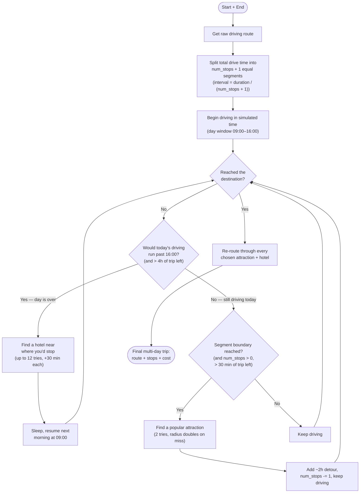

# Route-Finding Algorithm

How MyRoadtrip turns a start and end point into a multi-day road trip with
attractions and overnight hotels. All of this lives in the backend
(`backend/app/routers/routing_api.py`), with hotel scraping factored out into
`backend/app/routers/routing_fns/webscraping_fns.py`.

> The overview diagram below uses [Mermaid](https://mermaid.js.org/), which
> GitHub renders natively. The source and a rendered SVG also live in
> [`diagrams/`](./diagrams).

---

## Two-phase design

Route generation happens in two separate HTTP calls. The frontend
(`frontend/src/pages/ChatPage/getRoute.jsx`) drives both.

1. **`GET /get-initial-route`** — a cheap call that returns a raw Mapbox route
   with no stops. The frontend holds onto this object.
2. **`POST /generate-final-route`** — the frontend posts the raw route back
   along with `num_stops`, `budget`, and a `start` date. The backend schedules
   attractions and hotels along it, then re-routes through those stops to
   produce the final trip.

The heavy work (finding attractions, finding hotels, day-by-day scheduling) all
happens in phase 2, inside the private helper `_add_stops`.

---

## Logical overview

Before the code-level detail, here is the algorithm as a story — how it reasons
from a start/end pair to a finished multi-day trip, independent of which APIs it
calls:

1. Get the raw driving route from start to end.
2. Split the total drive time into `num_stops + 1` equal segments so the
   attractions land at even fractions between the endpoints
   (`interval = route.duration / (num_stops + 1)`). Placing N stops on a line
   creates N + 1 gaps — dividing by `num_stops` instead would push the last stop
   onto the destination.
3. Walk the route in simulated time, one segment per pass, looping
   `num_stops + 1` times (the extra pass covers the final leg into the
   destination). Each day has a fixed driving window of 09:00–16:00 (7 hours).
4. When a segment boundary comes up during the day — and stops remain, with more
   than ~30 min of trip left — stop for a popular attraction, budgeting a ~2 hour
   detour.
5. When the day's window would run past 16:00 (and more than 4 hours of trip
   remain), find a hotel near where you'd be, sleep, and resume the next morning
   at 09:00.
6. Repeat until the destination is reached.
7. Re-route through every chosen attraction and hotel to produce the real trip.

The rest of this document breaks that flow down into the actual functions and
external calls.

---

## Algorithm characterization

For an analytical view of this algorithm — the problem class it belongs to, why
it qualifies as a greedy heuristic, its complexity, and where it leaves value on
the table — see [algorithm-analysis.md](./algorithm-analysis.md). That document
also compares three alternative designs (classical optimization, pure-AI, and a
hybrid) for the planned optimization work. A short summary:

- **Problem class.** Choosing which attractions to visit and where to sleep,
  subject to a daily driving window and a hotel budget, is a constrained variant
  of the **Orienteering Problem** (a "TSP with profits") layered with **time
  windows** and a **budget/knapsack** constraint. The route ordering itself is
  fixed by geography (start → end along the driving line), so the hard part is
  *selection and scheduling*, not sequencing.
- **What kind of algorithm this is.** A **greedy, single-pass heuristic**. It
  walks the route once in simulated time and commits to a locally-best choice at
  each decision point (the nearest well-ranked attraction, the best in-budget
  hotel at day's end). It never backtracks or reconsiders an earlier pick.
- **Complexity.** The scheduling loop is `O(num_stops)`; per stop, position
  interpolation is `O(log n)` over a step's coordinates. Wall-clock cost is
  dominated by **external API calls** (Mapbox, TripAdvisor, Google, OpenCage),
  not CPU — each attraction and hotel search is one-or-more network round trips,
  with retries that multiply that.
- **Known limitations (the optimization opportunity).** Because every choice is
  greedy and local, the result is feasible but not optimal: a marginally
  higher-ranked attraction can be chosen even if it adds a large detour; an early
  hotel can consume a disproportionate share of budget; and the fixed constants
  (09:00–16:00 window, ~2h per attraction, ±$75 hotel band) are hand-tuned rather
  than derived. These are exactly the levers the analysis document explores.

---

## A note on coordinate order

This is the single biggest gotcha in the codebase. Two conventions coexist:

- **Internally** the app passes coordinates as `[lat, lon]`.
- **Mapbox and GeoJSON** use `[lon, lat]`.

So you will see explicit flips: the final-route endpoint unpacks Mapbox geometry
as `start_lon, start_lat = ...coordinates[0]`, and builds the Mapbox waypoint
string as `f"{lon},{lat}"` from internally-stored `[lat, lon]` stops.
`_find_position` swaps back to `(lat, lon)` before handing coordinates to
`geodesic`. Keep track of which convention you are in when reading the code.

---

## Phase 1: `GET /get-initial-route`

`get_initial_route(start_lat, start_lon, end_lat, end_lon)` simply calls
`_call_route(...)` with no waypoints and returns the raw
`MapBox.MapBox_Route` (the first/recommended route Mapbox returns). It contains
the full polyline (`geometry.coordinates`), a single `leg`, `duration`, and
`distance`.

`_call_route` builds a Mapbox Directions request:

- URL: `.../directions/v5/mapbox/driving/{start_lon},{start_lat};{end_lon},{end_lat}`
  (waypoints, if any, are inserted in the middle) — all in `lon,lat` order.
- Params: `geometries=geojson`, `overview=full`, `steps=true`, `alternatives=false`.
- The response is validated with `MapBox.model_validate(response.json())` and
  `routes[0]` is returned. There is no status-code check first, so an upstream
  failure surfaces as a `ValidationError` (mapped to HTTP 502).

---

## Phase 2: `POST /generate-final-route`

`get_final_route(request)` validates the body into `Route_Payload`, then:

1. Derives start/end coords from the initial route's geometry.
2. Calls `_add_stops(...)` to get the scheduled stops and total hotel cost.
3. Re-routes through those stops with `_call_route(...)`, producing a multi-leg
   route.
4. Walks the resulting legs to attach per-segment durations (and reverse-geocode
   any missing addresses via OpenCage).
5. Returns a `Route` with coordinates, distance, duration, stops, geometry, and
   cost.

Notes on the leg-walking loop:

- Each leg's `duration` is attached to the corresponding stop. The final leg
  into the destination appends a synthetic `{"name": "Arrive at your
  destination", "type": "end"}` stop.
- `Route.steps` is intentionally left empty. No client reads it — the frontend
  and the itinerary endpoint use `stops` and `geometry`, never `steps` — so the
  turn-by-turn list isn't built. The endpoint has a `NOTE` marking where to
  populate it from `leg.steps` if a client ever needs per-maneuver instructions.
- The returned `Route.cost` is the summed hotel cost from `_add_stops`.

---

## The scheduler: `_add_stops`

This is the core of the algorithm. It simulates driving the *initial* single-leg
route day by day, deciding at each moment whether to stop for an attraction or
end the day at a hotel. It never calls Mapbox itself — it works entirely off the
initial route's `legs[0].steps` and `geometry.coordinates`, using
`_find_position` to translate "elapsed drive time" into a coordinate.

Key timing setup:

- `interval = route.duration / (num_stops + 1)` — spacing between attraction
  stops. The `+ 1` is deliberate: N attractions divide the route into N + 1
  segments, so the stops fall at even fractions (1/(N+1), 2/(N+1), …) and the
  last one doesn't collide with the destination.
- Daily driving window: `daily_start = 9` to `daily_end = 16` (a 7-hour window).
- `end_hotel_search = duration - 4h` — stop looking for hotels in the last 4 hours.
- `end_stop_search = duration - 30min` — stop looking for attractions near the end.

> **The two `num_stops + 1`s are unrelated.** The one in `interval` is spacing
> math (above). The one in `for _ in range(num_stops + 1)` gives the loop one
> extra pass beyond the attractions so the final stretch into the destination
> still gets a chance to schedule an overnight hotel. Note `num_stops` is also
> decremented inside the loop body, but `range(...)` is evaluated once up front,
> so those decrements don't change the iteration count.

The loop runs `num_stops + 1` times. On each pass it first checks whether the
day's driving window is exhausted — if so it finds a hotel via `_find_hotel`
(up to 12 attempts, advancing 30 minutes each retry), adds its price to
`total_cost`, recomputes the price range, and rolls the clock to the next
morning. Otherwise, if a segment boundary is due and stops remain, it budgets a
2-hour detour and finds an attraction via `_find_stop` (2 attempts, doubling the
search radius on a 404). It returns the collected `stopping_points` and
`total_cost`. This is the code-level realization of the [logical
overview](#logical-overview) above.

### Dynamic hotel budget: `_get_price_range`

Rather than a fixed nightly cap, the budget is recomputed after each hotel based
on what's left:

- `days_left = (duration_left + stops_left * 2h) // daily_drive_time`
- `remaining_avg = remaining_budget / days_left`
- Band is `remaining_avg ± 75` (with a floored minimum), returned both as a
  numeric tuple (used by the Google scraper) and as a `"min-max"` string (used by
  the Amadeus fallback).

### Position interpolation: `_find_position`

Given an elapsed drive time in seconds, it walks the route's `steps`,
accumulating each `step.duration` until it finds the step you'd be in, then
interpolates a coordinate within that step's geometry using a binary search over
the step's coordinate list and geodesic distances. Returns `[lat, lon]`.

---

## Attraction discovery: `_find_stop` / `_get_details`

Attractions come from the TripAdvisor Content API. `_find_stop` runs a nearby
search, then calls `_get_details` on each candidate to read its ranking, keeping
the best one.

Selection is by TripAdvisor popularity ranking (rank 1 = most popular). The loop
short-circuits if it finds a rank-1 result. Locations whose details fail to parse
are assigned rank 999 and effectively de-prioritized. A 404 (no usable results)
bubbles up to `_add_stops`, which doubles the search radius and retries an hour
later.

---

## Hotel finding: `_find_hotel`

Hotels come primarily from scraping Google Hotels, with Amadeus as an optional
fallback (disabled by default — see below). `_find_hotel` reverse-geocodes the
target point, builds a search query (a nearby city from Google Places, falling
back to the geocoded address), then scrapes Google Hotels. If the scraper finds
nothing and the Amadeus fallback is enabled, it tries Amadeus; otherwise it
raises a 404 that `_add_stops` retries.

### Google Hotels scraping (`find_google_hotels`)

Lives in `webscraping_fns.py`:

1. GET `https://www.google.com/travel/search?q={query}` with a randomized,
   realistic user-agent.
2. `_parse_google_response` extracts listings via lxml (name, listing URL,
   star/review label, price) and sorts them ascending by star rating.
3. Filter to listings within the numeric `price_range`.
4. Examine only the **top 20%** by rating. For each, `_get_advanced_listing`
   scrapes the listing page for a precise address, geocodes it, and accepts the
   hotel only if it is within `radius` miles of the target coordinates.
5. Return the first qualifying hotel, else raise 404.

### Amadeus fallback

The Amadeus fallback is **disabled by default** because the upstream API is
currently nonfunctional. It is controlled by the `AMADEUS_ENABLED` environment
variable: set `AMADEUS_ENABLED=true` to re-enable it. When enabled, the fallback
runs whenever the Google scraper returns a 404 (no hotel found). It lists hotels
by geocode, fetches offers within the price range, gets sentiment ratings, and
returns the highest-rated hotel that fits.

> **History:** this was previously gated on `exception.status_code == 600` — a
> status code the scraper never raises — which silently made the branch dead and
> misleading. It is now an explicit `AMADEUS_ENABLED` flag checked against the
> scraper's real 404. While disabling the branch, two latent bugs in it were also
> fixed so it works if re-enabled: the check-out date now uses
> `timedelta(days=1)` (the old `day + 1` raised `ValueError` on month-end dates),
> and offers now carry the `hotel_id` key that `_find_hotel` reads back.

---

## Data models

Defined in `backend/app/models/routing_models/routing_models.py`.

| Model | Role |
|---|---|
| `Route_Payload` | Request body for `/generate-final-route` — `initial_route`, `num_stops`, `budget`, optional `start`. |
| `MapBox` / `MapBox_Route` | The full Mapbox Directions response. `MapBox_Route` (aliased `MapBox_route`) is what phase 1 returns. Nesting: `MapBox → routes → legs → steps`. |
| `Mapbox_geo` | `coordinates` (`[lon, lat]`) + `type`. Used for both raw and final geometry. |
| `Route` | The final response — `coordinates` (`[lat, lon]`), `distance`, `duration`, `steps`, `stops`, `geometry`, `cost`. |
| `Route_Step` | `distance`, `duration`, `instruction`, `location` — the shape a turn-by-turn step would take. Not currently emitted (see note below); kept for when a client needs per-maneuver instructions. |

---

## Gotchas worth remembering

- **Coordinate order** flips repeatedly between `[lat, lon]` (internal) and
  `[lon, lat]` (Mapbox/GeoJSON). This is a deliberate convention, not a bug.
- **`Route.steps` is always empty by design** — no client consumes it, so the
  turn-by-turn list isn't built. See the `NOTE` in `get_final_route` for where to
  populate it if that changes.
- **The Amadeus fallback is disabled by default** via `AMADEUS_ENABLED` (the
  upstream API is nonfunctional). It previously relied on an unreachable HTTP 600
  gate; that has been made explicit and its latent bugs fixed.
- **`_add_stops` schedules against the single-leg initial route**; the accurate
  multi-leg route is only computed afterward to get per-segment leg durations.
- **No status-code checks precede `.model_validate`** on external responses, so
  upstream failures manifest as `ValidationError` → HTTP 502.
- **Route generation does no database writes.** Persistence (route segmentation
  via `segment_route`) happens separately in the chat CRUD layer.
